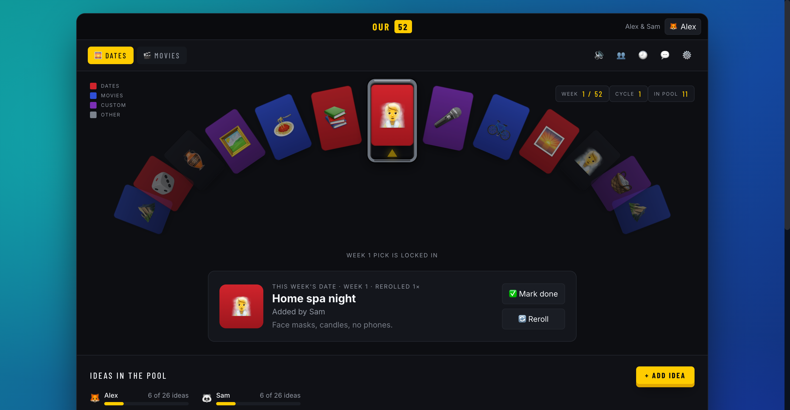

# Our 52 🎲🎬

A private couples activity roulette. Each couple keeps a shared space with two
collections by default — **Dates** and **Movies** — fills them with ideas, and
every week spins a curved, case-opening carousel to pick one. Reroll if it's not
the vibe, mark it done when you've done it, and (optionally) get the pick pushed
to WhatsApp where a 🔄 / ✅ reaction controls it too.

The interface is a faithful adaptation of a CS:GO-style "case opening" carousel:
teal→blue backdrop, near-black panel, an arched row of cards descending toward
the edges, a metallic selection frame with a yellow marker, and a yellow spin
button.



---

## Stack

| Layer     | Choice |
|-----------|--------|
| Frontend  | React 18 + TypeScript + Vite + Tailwind, React Query, React Router |
| Backend   | Node + TypeScript (run via `tsx`), Fastify, Zod |
| Database  | SQLite (single file) + Prisma (migrations + type-safe client) |
| Worker    | Persistent Node process (DB-backed scheduling + WhatsApp) |
| Realtime  | Server-Sent Events (couple-scoped) for live two-device sync |
| WhatsApp  | `whatsapp-web.js` (unofficial, free, self-hosted) — optional |
| Movies    | TMDB API for search + artwork — optional |
| Tests     | Vitest (unit/integration) + Playwright (browser) |
| Delivery  | Docker Compose (db + api + worker + web) |

The app runs fully **without** WhatsApp pairing or a TMDB key — both degrade
gracefully and show their real setup state.

---

## Quick start (Docker — reproducible)

```bash
cp .env.example .env          # adjust SESSION_SECRET etc.
docker compose up --build
```

- App: <http://localhost:8080>
- API: <http://localhost:4000>
- The `migrate` service applies migrations and (when `DEMO_MODE=true`) seeds the
  demo couple before `server`/`worker` start.

## Quick start (local, no Docker)

Requires Node ≥ 20 and pnpm. Storage is **SQLite** — no database server to run.

```bash
pnpm install

# apps/server/.env — SQLite file (default), e.g. DATABASE_URL=file:./dev.db
cp .env.example apps/server/.env    # then edit

pnpm --filter @our52/server db:migrate:dev   # create schema (creates prisma/dev.db)
pnpm --filter @our52/server db:seed          # demo couple + example ideas

# The API runs the scheduling worker inline (RUN_WORKER defaults true):
pnpm --filter @our52/server dev              # API on :4000 (+ inline worker)
pnpm --filter @our52/web dev                 # web on :5173
```

Open <http://localhost:5173>.

### Demo credentials (dev / `DEMO_MODE=true` only)

- `user1` / `12345` — Alex
- `user2` / `12345` — Sam

Both belong to the **same** couple space, so signing in as either shows the same
data. Demo accounts are rejected when `NODE_ENV=production` or `DEMO_MODE=false`,
and never expose real couples' data.

---

## How it works

### Accounts & couples
- Register with a username + password; a couple space is created for you.
- Generate a **secure, single-use, 72h-expiring** invite link for your partner.
- The partner registers/logs in and accepts. The **two-person limit is enforced
  on the server** inside a serializable transaction — even simultaneous accepts
  can't create a third member.
- Passwords are bcrypt-hashed; sessions are opaque tokens stored hashed, set as
  `httpOnly` cookies; login/register are rate-limited.

### Collections & ideas
- **Dates** and **Movies** by default; add custom collections too.
- Each collection has its own pool, weekly result, history, schedule, auto-select
  and notification settings.
- Contribution target defaults to **26 per person (52 total)** — a target, not a
  gate. Progress shows "N of 26 ideas" per person.
- You can add/edit/delete **your own** ideas. Editing or deleting never rewrites
  past results — every weekly result stores an immutable snapshot.

### The spin (selection correctness)
- The **server** picks and persists the winner **before** the client animates —
  the animation just presents the saved result.
- Selection is **uniformly random** across eligible ideas (equal probability;
  colored cards are decorative and do not affect odds). No contributor weighting.
- One canonical result per weekly period (`unique(periodId)`), so **concurrent
  spins from both devices return the same result**. Reloading/replaying never
  draws again — the button becomes **"Reveal this week"** and re-animates.
- Selected ideas are removed from future draws.

### Rerolls
- Replaces the current result; the rejected idea returns to the pool but is
  **excluded from the immediate replacement**.
- Optimistic concurrency on the revision number means **concurrent rerolls (web
  and/or WhatsApp) cause exactly one replacement**.
- Original result + full reroll history are preserved.
- If there's no alternative, it says so and keeps the current pick.

### Weekly cycle
- 52 weekly slots per cycle, anchored to the first configured weekday/time.
- Week numbering is the **activity cycle** (Week 1–52), distinct from calendar
  ISO weeks.
- After 52 weeks you can start a new cycle; history and ideas are preserved.

### Scheduling (worker)
- Default: **Sunday 8:00 PM, `America/New_York`**, DST-aware via Luxon IANA
  zones (8 PM stays 8 PM across spring-forward / fall-back — never a hardcoded
  offset). Weekday/time/zone are configurable per collection.
- **Manual** mode waits for a human to spin; **automatic** mode draws on schedule
  even with nobody online.
- Notifications are independent of selection. At notify time the worker sends the
  saved result, or a "go spin" reminder if manual mode produced nothing.
- If selection and notification are due together, the selection is **persisted
  first**, then notified.
- Idempotent via DB `JobRun` keys: **worker restarts never duplicate a weekly
  draw**, and only the current period is processed (no backlog of missed weeks).

### Live sync
- A couple-scoped SSE stream pushes change events; both partners' screens update
  without a manual refresh. Queries also refetch on window focus as a fallback.

---

## WhatsApp integration (optional, free)

Uses [`whatsapp-web.js`](https://github.com/wwebjs/whatsapp-web.js) (pinned
`1.26.0`). It's an **unofficial** client — it can disconnect or be blocked, and
needs an always-on host — but requires **no paid subscription or API**. These are
WhatsApp text messages/replies, **not carrier SMS**.

Setup (Settings → 💬):
1. Set `WHATSAPP_ENABLED=true` and restart the worker.
2. Open the WhatsApp panel and **Connect**; scan the QR (WhatsApp → Linked
   devices). The **paired phone is the sender** — it can be one of the partners.
   Sessions persist in `WHATSAPP_SESSION_DIR` and survive restarts.
3. Choose delivery to a **group** or **both individuals**, add recipient numbers,
   and send a **test message**.

Interactive commands (only from the two configured members / chats):
- React 🔄 or reply `REROLL` → reroll · React ✅ or reply `DONE` → complete.
- Unquoted `REROLL DATES` / `REROLL MOVIES` target a collection; ambiguous
  unquoted commands ask which collection.
- Removed reactions, replayed events, bot-authored messages, unauthorized
  senders, and commands against superseded results are all ignored (dedup via a
  processed-events ledger). Outbound sends are tracked in an **outbox** and
  uncertain outcomes are reconciled, not blindly retried.

If WhatsApp is disabled, a fixture adapter is used so the rest of the app behaves
identically (and the test suite exercises the command logic with fixtures).
**Live delivery and live reactions are unverified** in this build (no phone was
paired).

---

## TMDB movie search (optional)

Set `TMDB_API_KEY` ([free developer key](https://developer.themoviedb.org/docs)).
Then Movies entries can search real titles and store the TMDB id, poster, and
backdrop, shown in cards and result views. Without a key, **manual movie entry
still works** and the UI explains how to enable artwork. Required attribution is
included and the free tier is non-commercial — see the WhatsApp/TMDB notes in
Settings.

---

## Testing

```bash
pnpm --filter @our52/server test     # 67 unit/integration tests (SQLite; no setup)
pnpm --filter @our52/web test:e2e    # Playwright browser flows
```

Automated coverage includes: selection (spin/reveal/reroll/exclusion/uniformity),
concurrency (one result / one replacement), authorization & couple isolation,
invitation two-person limit incl. simultaneous accepts, DST-aware scheduling,
worker restart idempotency, and WhatsApp event deduplication (removed/stale/
unauthorized/replayed). See `apps/server/test/`.

No setup needed — the test suite creates a throwaway SQLite DB
(`apps/server/prisma/test.db`) automatically via `test/globalSetup.ts`:

```bash
pnpm --filter @our52/server test
```

Visual QA (screenshots at 800×600, 1440×900, 390×844 across initial/spinning/
settled states) and the reference-comparison notes live in
[`docs/visual-qa/`](docs/visual-qa/README.md).

---

## Persistence & backup

- All durable state is a **single SQLite file** (`DATABASE_URL`, e.g.
  `/data/our52.db`). In Docker/Railway it lives on the `our52_data` volume.
  Back it up by copying the file off the volume; restore by dropping it back.
- WhatsApp session credentials persist under `WHATSAPP_SESSION_DIR` (also on the
  volume). Protect the volume — it grants WhatsApp access. QR payloads and
  secrets are never logged.

## Self-hosting

Any always-on host that runs Docker works (a small VPS is plenty). Point a domain
at the `web` service, set `APP_BASE_URL`/`CORS_ORIGINS` to your URL, put a real
`SESSION_SECRET` in `.env`, and set `DEMO_MODE=false` in production. There is **no
free permanent hosting promised** — the worker (and WhatsApp) needs to stay
running.

---

## Project layout

```
apps/
  server/            # API + worker (Fastify, Prisma, features/*)
    prisma/          # schema, migrations, idempotent demo seed
    src/
      app/           # bootstrap, routes (thin), http helpers
      features/      # auth, collections, entries, selection, scheduling, movies, whatsapp
      platform/      # db, config, logger, security, realtime bus
      shared/        # time (DST math), errors
    test/            # vitest suites
  web/               # React app (Vite + Tailwind)
    src/
      app/           # routing + shell
      features/      # auth, roulette (carousel), entries, settings, history, whatsapp
      components/ui/ # Dialog, Wordmark, Toggle
      platform/      # api client, realtime SSE hook
    e2e/             # Playwright specs
docs/visual-qa/      # reference comparison + screenshots
Dockerfile.server  Dockerfile.web  docker-compose.yml  .env.example
```

Data model: `User, Session, Couple, Membership, Invitation, Collection, Entry,
WeeklyPeriod, WeeklyResult, ResultRevision, WhatsAppSession, WhatsAppConfig,
OutboundMessage, ProcessedInboundEvent, JobRun`.
